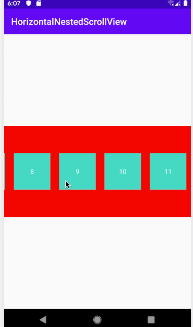

## Usage

1. Project build.gradle file.
   
   ```groovy
	...
	allprojects {
    	repositories {
        	google()
        	jcenter()
        	maven { url "https://www.jitpack.io" }
    	}
	}
	...
   ```
   
2. Module build.gradle file.

	```groovy
	...
	dependencies {
    	...
    	implementation 'com.github.Tans5:horizontalnestedscrollview:0.1.0'
    	...
	}
	...
	```
    
3. Add in layout xml file.
	
    ```xml
      ...
      <com.tans.horizontalnestedscrollview.HorizontalNestedScrollView
        android:layout_width="match_parent"
        android:layout_height="wrap_content"> 
        ...
      </com.tans.horizontalnestedscrollview.HorizontalNestedScrollView>
      ...
    ```
    
## Screenshots



